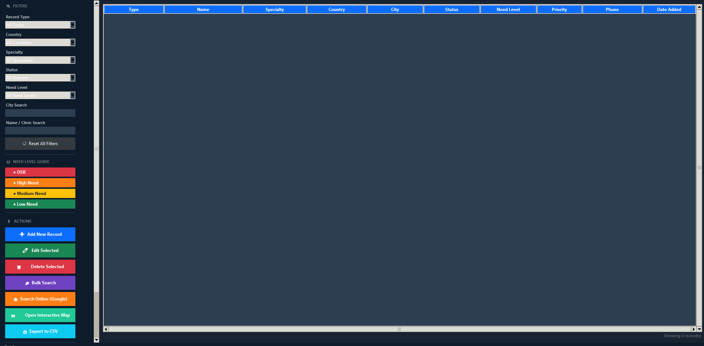
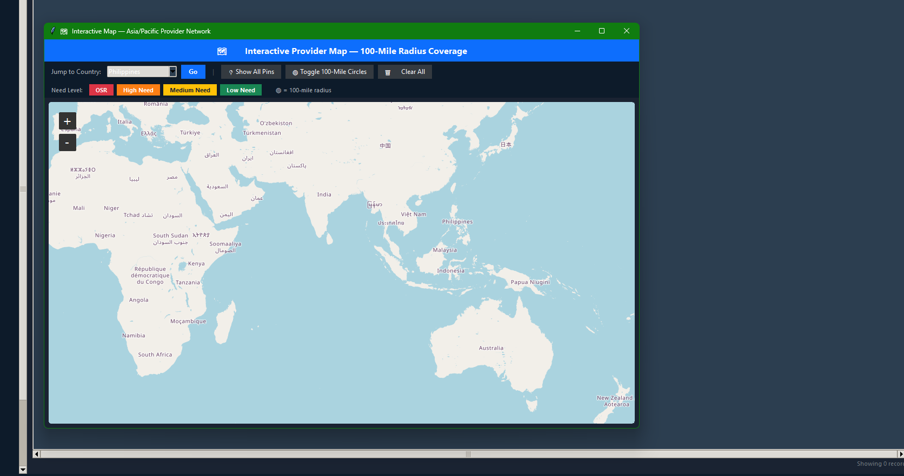
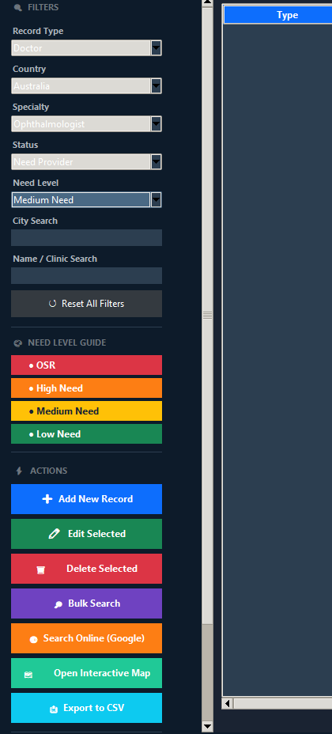
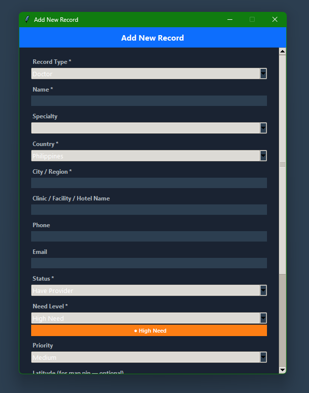
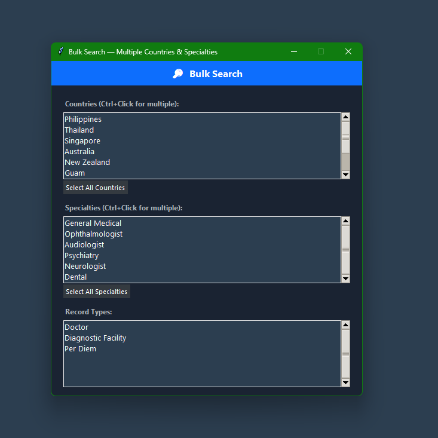

# Provider Recruitment Manager

A desktop application for locating, tracking, and managing English-speaking medical providers, diagnostic facilities, and per-diem locations across the Asia/Pacific region — built to streamline recruitment for regional medical evaluation appointments.


---

## Overview

This is a single-file Python desktop app (Tkinter) that replaces spreadsheet-based recruitment tracking with a purpose-built, map-aware tool. A recruiter can add providers and facilities, see them plotted on an interactive map with coverage radii, filter by need level and location, and jump straight to a targeted web search — all from one window.

## Features

- **Record management** — track three record types (Doctors, Diagnostic Facilities, Per Diem locations) with specialty, city, country, coordinates, and free-form notes, persisted to a local JSON file.
- **Interactive map** — providers and facilities plotted with [tkintermapview](https://github.com/TomSchimansky/TkinterMapView), including **100-mile radius circles** to visualize coverage gaps.
- **Geo-radius math** — great-circle distance calculations to determine which cities fall inside a facility's coverage area.
- **Color-coded need levels** — visual priority cues so high-need locations stand out.
- **Search & filter** — by name, clinic, specialty, city, or country, plus a bulk-search mode.
- **One-click web search** — builds a targeted Google query from the selected record's fields and opens it in the browser.
- **CSV export** — export the current record set for reporting or sharing.
- **Collapsible side panel** — keeps the map front-and-center while giving quick access to controls.

## Tech Stack

| Area | Details |
|------|---------|
| Language | Python 3.10+ |
| GUI | Tkinter / ttk |
| Mapping | tkintermapview |
| Storage | Local JSON (no database required) |
| Distribution | Packaged to a standalone Windows `.exe` with PyInstaller |

## Running It

```bash
# 1. Install the one third-party dependency
pip install -r requirements.txt

# 2. Run
python provider_recruitment_manager.py
```

The app creates a `recruitment_data.json` file in the working directory on first save. (That file is git-ignored so no records are ever committed.)

## Screenshots

**Main window** — record table with a filter sidebar, color-coded need-level guide, and action buttons.



**Interactive map** — providers plotted across the Asia/Pacific region with optional 100-mile coverage circles and per-need-level filtering.



**Filtering** — narrow the list by record type, country, specialty, status, and need level.



**Add / edit records** — a validated form for capturing providers, facilities, and per-diem locations, including coordinates for map pins.



**Bulk search** — build a combined query across multiple countries, specialties, and record types at once.



## Notes

This tool was originally built to support a real recruiting workflow; identifying branding and any operational data have been removed for this public portfolio version. It demonstrates desktop GUI design, third-party map integration, geospatial calculations, and local data persistence in pure Python.

---

*Built by Addison Flynn.*
